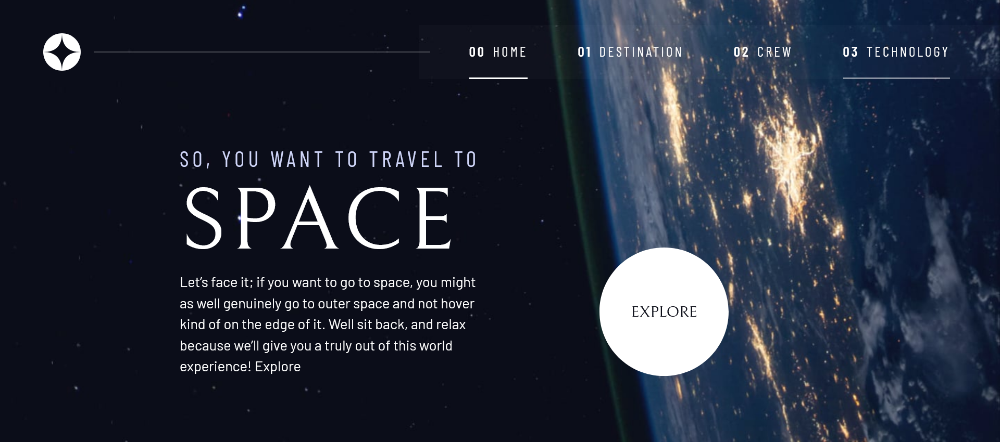

# Frontend Mentor - Space tourism website solution

This is a solution to the [Space tourism website challenge on Frontend Mentor](https://www.frontendmentor.io/challenges/space-tourism-multipage-website-gRWj1URZ3). Frontend Mentor challenges help you improve your coding skills by building realistic projects.

## Table of contents

- [Overview](#overview)
  - [The challenge](#the-challenge)
  - [Screenshot](#screenshot)
  - [Links](#links)
- [My process](#my-process)
  - [Built with](#built-with)
  - [What I learned](#what-i-learned)
  - [Author](#author)
- [Acknowledgments](#acknowledgments)

**Note: Delete this note and update the table of contents based on what sections you keep.**

## Overview

### The challenge

Users should be able to:

- View the optimal layout for each of the website's pages depending on their device's screen size
- See hover states for all interactive elements on the page
- View each page and be able to toggle between the tabs to see new information

### Screenshot

### Links

- Solution URL: [https://github.com/riwepo/fem-space-tourism-website](https://github.com/riwepo/fem-space-tourism-website)
- Live Site URL: [https://riwepo.github.io/fem-space-tourism-website/](https://riwepo.github.io/fem-space-tourism-website/)

## My process

### Built with

- Semantic HTML5 markup
- CSS custom properties
- Flexbox
- CSS Grid
- Mobile-first workflow
- [React](https://reactjs.org/) - JS library

### What I learned

I learned a huge amount from this project.

This was my first challenge using react-router-dom.js

It was challenging following along with Kevin, and then adapting what he was doing to react.

The main learning was how Kevin develops a plug and play design system using CSS, with lots of small pieces that can be combined together.

Kevin writes his HTML desktop first because it is more complex, then when he styles he does it mobile first.

''So you want to travel to space.''
We considered this as one sentence, put it all in a h1, and used span to mess with the display.

How to use isActive passed to the children property of NavLink to alter display of active link.

I used a proper CSS reset for the first time.

Used CSS variable names with prefix rather than suffix, helps with intellisense.

Adjust alpha in colors while still using CSS variable.

Using undefined custom properties with default values that can later be tweaked.

Use left/right padding and aspect ratio for styling buttons.

''place-items'' shorthand in grid.

If putting img in a flex container, wrap it in a div to avoid some bugs in the Chrome browser.

Using a clamp on large fonts, based on vw or viewport unit, means that the font continaully changes size as we re-size the screen, doesn't just break at the media query point.

For media query breakpoints in 2023 we should use px, see
https://cgamesplay.com/post/2023/05/19/stop-using-em-in-media-queries/

Use of bottom centre to position background image when the image has interesting content at the bottom.

Use of ''inset'' property for overlay menus.

Reverse media query for mobile menu i.e. even though we styled mobile first, when doing the overlay menu he reversed things and put the mobile code in the media query.

@supports with property/value pairs checks if can use in current browser.

Can use a data attribute to communicate state to css, rather than adding another class.

focus-visible attribute

use of 'and' in media query to target just the tablet screen size

shift focus between tabs and dots when seleted index changes, using useRef, a ref array and useEffect

## Author

- Frontend Mentor - [@yourusername](https://www.frontendmentor.io/profile/yourusername)

## Acknowledgments

Thanks to Scrimba and Kevin Powel, I learned a huge amount from this project.
